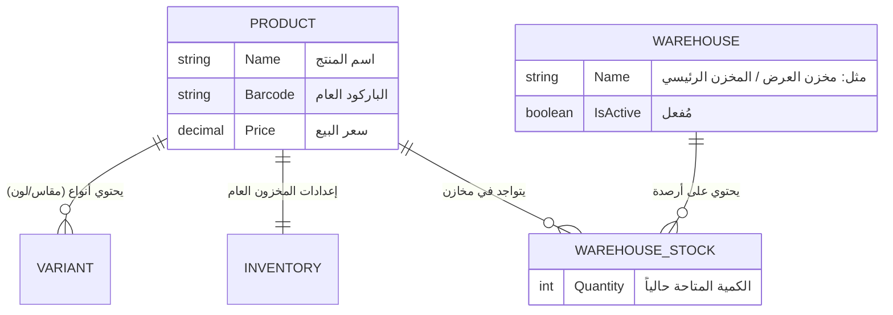
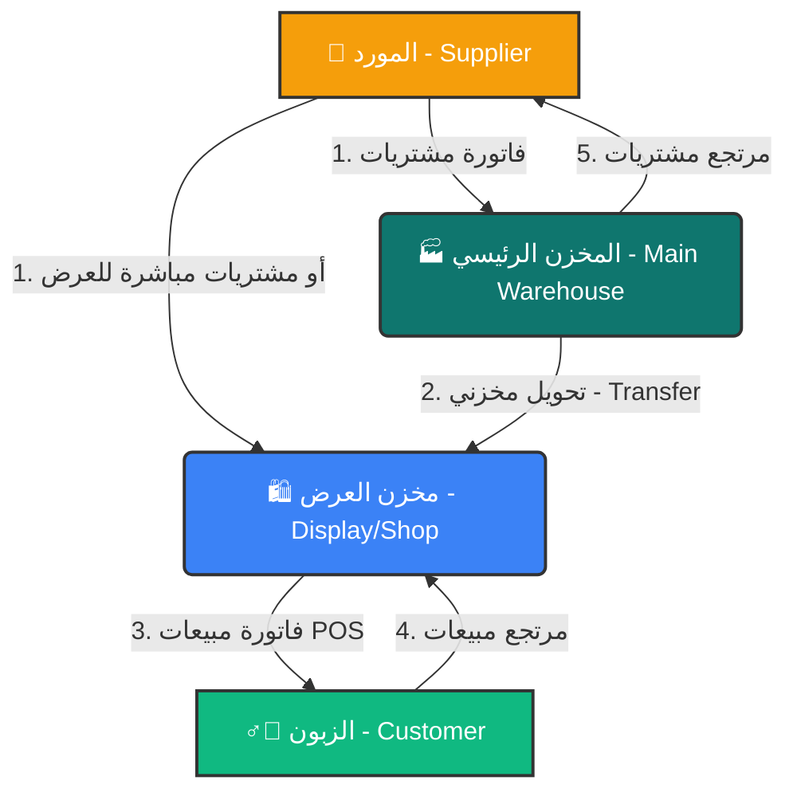

# دليل دورة الأصناف والمخازن في نظام الـ ERP

هذا الدليل يشرح بالتفصيل كيفية إدارة الأصناف، والمخزون، والفرق بين "كمية العرض" و"المخزن"، مع توضيح مسار البضاعة من لحظة الشراء وحتى البيع للزبون.

---

## 1. الهيكل الأساسي للأصناف والمخازن

النظام مصمم ليكون مرناً ومُحاكياً للواقع. لا يتعامل النظام مع المنتجات كأرقام مجردة فقط، بل يفصل بين الصنف الأساسي، وأنواعه (المقاسات والألوان)، وأماكن تخزينه.

> [!NOTE]
> **كمية العرض (Display):** هي البضاعة المتاحة أمام الزبائن على الأرفف (في صالة البيع أو المحل).
> **كمية المخزن (Warehouse):** هي البضاعة المُخزنة في المستودع الداخلي كاحتياطي لتغذية صالة العرض.

### المخطط الهيكلي لقاعدة البيانات (Entity Structure)
يوضح هذا المخطط علاقة المنتج بالمخازن والأنواع:

---

## 2. نظام المخازن المتعددة

بدلاً من الاعتماد على مجرد أرقام ثابتة لكمية العرض والمخزن، يقوم النظام باعتبار كل مكان تخزين كـ **"مخزن مستقل"**:
1. **مخزن "عرض" (Display Warehouse):** مكان افتراضي أو حقيقي يمثل الأرفف وصالة البيع.
2. **"مخزن رئيسي" (Main Warehouse):** يمثل المستودع الفعلي الخلفي.
3. **مخازن إضافية:** يمكنك إضافة مخازن للفروع الأخرى بحرية تامة.

إجمالي كمية الصنف في النظام هو **مجموع الأرصدة** لهذا الصنف في جميع المخازن المتاحة.

---

## 3. مسار دورة المخزون (Inventory Workflow)

البضاعة في النظام تمر بدورة حياة تبدأ من الشراء (المورد) وتنتهي بالبيع (الزبون). المخطط التالي يوضح هذا المسار:

### شرح خطوات المسار:

1. **دخول البضاعة (المشتريات):**
   عند تسجيل فاتورة مشتريات، يطلب منك النظام تحديد **"المخزن الوجهة"**. يمكنك إدخال الكمية الكبيرة في **المخزن الرئيسي**، أو وضعها مباشرة في **العرض** إذا كانت الكمية قليلة ومطلوبة فوراً.

2. **التحويل بين المخازن (Transfers):**
   عندما تبدأ الأرفف في صالة العرض بالنفاد، يقوم الموظف بعملية **"تحويل مخزني" (Warehouse Transfer)**. يتم خصم الكمية من (المخزن الرئيسي) وإضافتها إلى (مخزن العرض). هذا يضمن تتبعاً دقيقاً لأماكن البضاعة.

3. **خروج البضاعة (المبيعات):**
   عندما يقوم الكاشير (عبر شاشة نقاط البيع POS) بعمل فاتورة بيع، يتم **سحب الكمية تلقائياً من مخزن "العرض"** لأن هذا هو المكان الفعلي الذي أخذ منه الزبون البضاعة.

4. **المرتجعات:**
   - **مرتجع المبيعات:** الزبون يعيد البضاعة، فتعود الكمية إلى مخزن "العرض" (أو يمكنك إعادتها يدوياً للمخزن الرئيسي إذا كانت تالفة عبر التحويل).
   - **مرتجع المشتريات:** إعادة بضاعة تالفة أو زائدة للمورد تسحب من المخزن الذي تتواجد فيه البضاعة (غالباً المخزن الرئيسي).

---

## 4. الفوائد الإدارية لهذا النظام

> [!TIP]
> **دقة الجرد (Accurate Auditing):** عندما تقوم بجرد "المعرض"، ستقارن البضاعة الفعلية على الرف برصيد "مخزن العرض" في النظام فقط، ولن تتلخبط مع الكميات الموجودة في المستودع المغلق.
> 
> **منع التلاعب:** الموظف المسؤول عن صالة العرض مسؤول فقط عن عهدة (مخزن العرض). وأمين المخزن مسؤول عن عهدة (المخزن الرئيسي). 
> 
> **تنبيهات الحد الأدنى (Re-order level):** يقوم النظام بمراقبة إجمالي المخزون، وينبهك عندما تقترب كمية صنف معين من النفاذ، لكي تطلب طلبية جديدة من المورد في الوقت المناسب.
