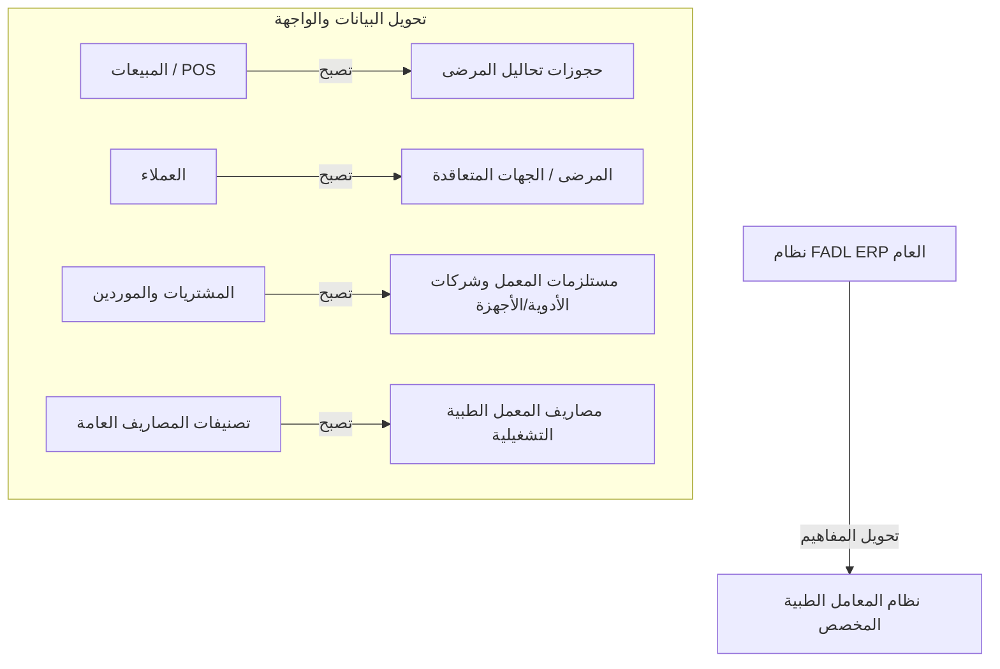

# دليل تصميم وهندسة شاشة الحسابات والخزينة 📑
## (مع خطة التكييف والتطبيق لبرنامج إدارة المعامل الطبية)

يحتوي هذا الملف على توثيق شامل لشاشة **الحسابات والخزينة (Treasury)** في نظام FADL ERP من حيث الوظائف، والمنطق البرمجي (Logic)، والتصميم الجمالي (UI/UX)، مع تقديم دليل تفصيلي لكيفية تكييفها وتطبيقها في **نظام إدارة معامل التحاليل الطبية**.

---

## 1. البنية التحتية والبيانات الأساسية (Data Structure)
تعتمد شاشة الحسابات على أربعة كيانات رئيسية متكاملة:

1. **الخزن (Treasuries):** 
   - تمثل الحسابات المالية الفعلية (خزينة رئيسية، كاشير 1، كاشير 2، حساب بنكي، إلخ).
   - لكل خزينة: `ID`، `Name` (الاسم)، `Code` (الكود)، `OpeningBalance` (الرصيد الافتتاحي)، `CurrentBalance` (الرصيد الحالي)، وحالة الخزنة (`isActive`نشطة / موقوفة).
   
2. **وسائل الدفع (Payment Methods):**
   - لتصنيف التدفقات المالية داخل الخزينة الواحدة.
   - الوسائل الافتراضية: نقدي (`CASH`)، محفظة إلكترونية (`VODAFONE_CASH`)، شبكة مدفوعات فورية (`INSTAPAY` / فيزا).
   - يتم احتساب رصيد مجزأ (Breakdown) لكل وسيلة دفع داخل كل خزينة.

3. **حركات القيود الماليّة (Treasury Entries / Transactions):**
   - تسجل كل تدفق مالي صادر أو وارد مع مرجع العملية.
   - **أنواع القيود (Entry Types):**
     - وارد: رصيد افتتاحي (`OPENING_BALANCE`)، إيراد بيع (`SALE_INCOME`)، قسط عميل (`CUSTOMER_PAYMENT`)، تسوية زيادة (`ADJUSTMENT_IN`)، تحويل وارد (`TRANSFER_IN`)، إضافة يدوية (`MANUAL_IN`).
     - صادر: صرف مصروف (`EXPENSE_PAYMENT`)، سداد مشتريات (`PURCHASE_PAYMENT`)، سداد مورد (`SUPPLIER_PAYMENT`)، رد قيمة مرتجع (`RETURN_REFUND`)، تسوية عجز (`ADJUSTMENT_OUT`)، تحويل صادر (`TRANSFER_OUT`)، صرف يدوية (`MANUAL_OUT`).
   - يحتوي القيد على: `amount` (المبلغ)، `direction` (وارد IN / منصرف OUT)، `balanceAfter` (الرصيد بعد الحركة)، و`referenceType` و`referenceId` لربطه بالفاتورة أو المصروف الأصلي.

4. **المصروفات وتصنيفاتها (Expenses & Categories):**
   - نظام مستقل لإدارة بنود المصاريف اليومية وتصنيفها (رواتب، إيجار، فواتير كهرباء ومياه، إلخ) مع تخصيص لون فريد لكل تصنيف لسهولة قراءة التقارير بيانيًا.

---

## 2. أقسام الشاشة الرئيسية (Tabs Layout)
تنقسم الواجهة إلى 4 تبويبات رئيسية تسهل الوصول للبيانات:

### أ. تبويب الخزن (Treasuries):
* **عرض أرصدة الخزن:** بطاقات (Cards) مميزة تعرض الرصيد الإجمالي لكل خزينة، بالإضافة إلى تفصيل رصيدها الموزع على (كاش، فودافون كاش، إنستاباي).
* **إجراءات سريعة:**
  - تعيين خزينة افتراضية للنظام (Default Treasury).
  - إضافة خزنة جديدة أو تعديل البيانات الأساسية.
  - حذف الخزنة (مع حماية برمجية: إذا كانت مرتبطة بعمليات سابقة، يتم أرشفتها بأمان دون مساس بالبيانات المالية التاريخية).

### ب. تبويب الحركات والقيود (Transactions):
* **فلترة متقدمة للعمليات:** بالخزينة، التاريخ (من/إلى)، الاتجاه (وارد/منصرف)، تصنيف القيد، والمستخدم الذي قام بالعملية.
* **نموذج تسجيل حركة يدوي:**
  - يدعم عمليات الإدخال اليدوي المباشر (وارد / منصرف).
  - يدعم عمليات التحويل الداخلي المباشر بين الخزن (`TRANSFER`) مع التحقق التلقائي من كفاية رصيد خزينة المصدر.
* **طباعة كشف حركات الخزينة:** إنشاء مستند A4 منسق وجاهز للطباعة يحتوي على حركة الحساب المالية التفصيلية.

### ج. لوحة الإيراد اليومي (Daily Revenue Dashboard):
لوحة تحليل مالي فورية تعرض أداء الوردية أو اليوم:
* **مؤشرات الأداء المالي (KPIs):**
  1. إجمالي المبيعات.
  2. المقبوضات الفعلية (المدفوع من المبيعات + أقساط العملاء القديمة).
  3. المبالغ المتبقية (الديون الآجلة على العملاء).
  4. المرتجعات والمصروفات الإجمالية.
  5. صافي التدفق النقدي (الربح النقدي الفعلي في الدرج).
* **تقارير التجميع (Aggregation):**
  - تجميع الإيراد حسب مصدر القيد (مبيعات، مصروفات، أقساط).
  - تجميع الإيراد حسب وسيلة الدفع (نسبة ونقدي لكل وسيلة).
  - تجميع الإيراد حسب الخزنة الفرعية.
* **زر طباعة تقرير الوردية (Z-Report):** تقرير مالي موحد للغلق اليومي للوردية يُظهر تفاصيل المقبوضات وتوقيتاتها.

### د. تبويب المصروفات (Expenses):
* **تسجيل المصاريف:** مع ربطها بالخزينة المصدر ووسيلة الدفع لتحديث الرصيد فورًا.
* **إدارة تصنيفات المصاريف:** نظام مرن لإنشاء تصنيفات مصبوغة بألوان مميزة (بصرياً) لحساب نسب الهدر والإنفاق بدقة.

---

## 3. الهوية البصرية والتصميم الجمالي (UI/UX Guidelines)
تعتمد الشاشة على نمط **العصرية والوضوح المالي** لتوفير تجربة مستخدم مريحة للعين وخالية من الأخطاء:

* **لوحة الألوان المخصصة (Teal & Slate System):**
  - الخلفية العامة: تدرج ناعم يجمع بين الأبيض الثلجي والأزرق الفاتح جداً، مع تدرجات دائرية في الأعلى لكسر الجمود البصري:
    ```css
    background: radial-gradient(circle at 14% 0%, rgba(15, 118, 110, 0.08), transparent 42%),
                radial-gradient(circle at 84% 12%, rgba(15, 53, 83, 0.1), transparent 46%),
                linear-gradient(180deg, #eef6f6, #f8fbff);
    ```
  - الوارد (IN): اللون الأخضر الزمردي (`#047857`) مع خلفية خضراء خفيفة جداً في البطاقات المخصصة له.
  - المنصرف (OUT / المصروفات): اللون الأحمر الناري (`#b91c1c`) للإشارة الفورية لعمليات الصرف.
  - بطاقات التبويبات الفعالة (Tabs): تأثير زجاجي مع تدرج لوني يعكس القوة والاحترافية:
    ```css
    background: linear-gradient(135deg, #0f766e 0%, #0d9488 100%);
    box-shadow: 0 4px 14px rgba(15, 118, 110, 0.3);
    ```

* **التأثيرات الحركية والتفاعلية (Animations & Micro-interactions):**
  - استخدام تأثير صعود اللوحة التدريجي (Rise animation) عند فتح أي تبويب:
    ```css
    @keyframes panel-rise {
      from { opacity: 0; transform: translateY(4px); }
      to { opacity: 1; transform: translateY(0); }
    }
    ```
  - تأثيرات التحويم (Hover Effects) على البطاقات مثل الارتفاع الخفيف وزيادة تباين الظل: `transform: translateY(-4px)`.

* **نوافذ عرض التفاصيل الدقيقة (Drill-Down Modals):**
  عند الضغط على أي بند إجمالي في لوحة الإيراد (مثلا إجمالي الكاش)، تنبثق نافذة تعرض العمليات التفصيلية التي كونت هذا الإجمالي مباشرة مع زر إغلاق ناعم وتأثير زجاجي مظلل للخلفية (`backdrop-filter: blur(4px)`).

---

## 4. خطة تكييف الشاشة لبرنامج "إدارة المعامل الطبية" 🧪
لتحويل هذه الشاشة المالية القوية إلى نظام مالي مخصص لمعامل التحاليل الطبية بنجاح، يجب تعديل المفاهيم والعمليات لتتوافق مع طبيعة العمل الطبي:



### أ. مطابقة الكيانات والمسميات (Entity Mapping):
1. **المبيعات (Sales / POS) ➡️ حجوزات الفحوصات والتحاليل:**
   - بدلاً من إيراد بيع بضاعة، يصبح الإيراد هو **"قيمة حجز التحاليل"** لطلب مريض.
   - تصبح شاشة الدفع مرتبطة بكود طلب التحليل (مثال: طلب تحليل رقم #1205).
2. **العملاء (Customers) ➡️ المرضى والجهات المتعاقدة (Patients & Contracted Entities):**
   - ينقسم المدينون بالمعمل إلى:
     * **مرضى عاديين (Patients):** متبقي عليهم جزء من ثمن التحليل يتم تحصيله عند استلام النتيجة.
     * **جهات متعاقدة (Companies/Insurance):** نقابات، شركات تأمين طبي، جمعيات خيرية. يتم إجراء التحاليل لمنتسبيها بخصومات معينة، وتتراكم المبالغ كديون آجلة تُسدد دورياً بشيكات أو تحويلات تدخل الخزنة.
3. **الموردين (Suppliers) ➡️ شركات المستلزمات الطبية وصيانة الأجهزة:**
   - موردو المواد الكيميائية (Chemical Reagents)، العينات، الأنابيب، المحاقن، ومهندسو صيانة أجهزة التحاليل الطبية.

### ب. هيكل الحركات المالية المخصص للمعمل (Lab-Specific Financial Entries):
يجب استبدال أو إضافة تصنيفات الحركات التالية في الـ Backend والـ Frontend:
* **حركات الإيراد (In):**
  - **إيراد تحليل نقدي (`LAB_CASH_INCOME`):** مبالغ تحاليل سددها المرضى بالكامل فوراً.
  - **تحصيل متبقي مريض (`PATIENT_DUE_PAYMENT`):** تحصيل باقي ثمن التحليل عند تسليم تقرير النتيجة.
  - **سداد جهة متعاقدة (`CONTRACT_COMPANIES_PAYMENT`):** سداد مالي من شركة تأمين أو نقابة لصالح حساب المعمل.
* **حركات الصرف (Out):**
  - **عمولات الأطباء (`DOCTOR_COMMISSIONS`):** بعض المعامل تخصص نسبة للأطباء الذين يوجهون المرضى للمعمل؛ ويجب صرفها وإثباتها مالياً كبند مصروف.
  - **معايرة الأجهزة وصيانتها (`DEVICE_CALIBRATION`):** مصروفات دورية هامة لضمان دقة أجهزة المعمل الطبية.
  - **التخلص من النفايات الطبية (`BIO_WASTE_DISPOSAL`):** مصروفات تدفع لجهات رسمية للتخلص الآمن من النفايات الطبية الخطرة.
  - **مشتريات مستهلكات طبية (`MEDICAL_SUPPLIES`):** شراء إبر، قطن، كواشف، إلخ.

### ج. لوحة الإيراد اليومي للمعمل (Medical Lab Dashboard):
تعديل لوحة الإيراد اليومي لتشمل مؤشرات أداء تهم صاحب المعمل:
* **عدد الحالات اليومية (Daily Patient Count):** عدد المرضى الذين تم استقبالهم اليوم.
* **التحاليل المنجزة (Completed Tests Count):** إجمالي عدد الفحوصات الفردية المطلوبة.
* **إيرادات التعاقدات (Contractual Revenues):** المبالغ الآجلة التي قُيدت اليوم لصالح حساب النقابات والشركات (غير نقدية بالخزينة حالياً ولكنها ضمن الأرباح المستحقة).
* **الصافي النقدي الفعلي بالدرج (Actual Cash Drawer Net):** وهو النقد الحقيقي المتاح بعد استبعاد المصاريف اليومية والعمولات المصروفة نقداً.

---

## 5. نموذج كود مالي مقترح للمعمل الطبي (React Skeleton)
يمكنك أخذ هذا الهيكل وتضمينه مباشرة في مشروع المعمل الطبي الخاص بك كشاشة متكاملة للحسابات:

```jsx
// LabTreasury.jsx
import React, { useState, useEffect, useMemo } from 'react';
import { Landmark, TrendingUp, HandCoins, UserPlus, ShieldAlert, Eye, Printer, Plus } from 'lucide-react';
import './LabTreasury.css';

export default function LabTreasury() {
  const [activeTab, setActiveTab] = useState('daily');
  const [treasuries, setTreasuries] = useState([]);
  const [dailyReport, setDailyReport] = useState({
    patientCount: 0,
    totalBookings: 0,
    collectedAmount: 0,
    remainingAmount: 0,
    contractAmount: 0,
    expensesAmount: 0,
    doctorCommissions: 0,
    netCash: 0
  });

  // فلاتر البحث والتقارير
  const [filters, setFilters] = useState({
    fromDate: new Date().toISOString().split('T')[0],
    toDate: new Date().toISOString().split('T')[0],
    treasuryId: ''
  });

  return (
    <div className="lab-treasury-page">
      {/* هيدر الصفحة والتبويبات */}
      <section className="lab-treasury-header">
        <div className="title-area">
          <Landmark size={28} className="brand-icon" />
          <div>
            <h1>إدارة الخزائن والحسابات الطبية</h1>
            <p>مراقبة التدفقات النقدية، إيرادات التحاليل، حسابات الجهات المتعاقدة، والمصروفات الطبية.</p>
          </div>
        </div>

        <div className="tab-navigation">
          <button className={`tab-btn ${activeTab === 'daily' ? 'active' : ''}`} onClick={() => setActiveTab('daily')}>
            <TrendingUp size={18} /> لوحة الإيراد الطبي اليومي
          </button>
          <button className={`tab-btn ${activeTab === 'treasuries' ? 'active' : ''}`} onClick={() => setActiveTab('treasuries')}>
            <Landmark size={18} /> الخزن والعهود الطبية
          </button>
          <button className={`tab-btn ${activeTab === 'expenses' ? 'active' : ''}`} onClick={() => setActiveTab('expenses')}>
            <HandCoins size={18} /> المصروفات التشغيلية للمعمل
          </button>
        </div>
      </section>

      {/* محتوى التبويبات */}
      {activeTab === 'daily' && (
        <div className="tab-content fade-in">
          {/* كروت الإحصائيات الطبية والمالية السريعة */}
          <div className="kpi-container">
            <div className="kpi-card-lab patient-stat">
              <span className="kpi-title">إجمالي المرضى اليوم</span>
              <strong className="kpi-val">{dailyReport.patientCount} مريض</strong>
            </div>
            <div className="kpi-card-lab bookings-stat">
              <span className="kpi-title">حجوزات التحاليل</span>
              <strong className="kpi-val">{dailyReport.totalBookings} ج.م</strong>
            </div>
            <div className="kpi-card-lab cash-stat">
              <span className="kpi-title">المحصل النقدي (الدرج)</span>
              <strong className="kpi-val text-success">{dailyReport.collectedAmount} ج.م</strong>
            </div>
            <div className="kpi-card-lab due-stat">
              <span className="kpi-title">متبقي معلق على المرضى</span>
              <strong className="kpi-val text-danger">{dailyReport.remainingAmount} ج.م</strong>
            </div>
          </div>

          <div className="kpi-container second-row">
            <div className="kpi-card-lab contract-stat">
              <span className="kpi-title">حساب النقابات والشركات (آجل)</span>
              <strong className="kpi-val text-brand">{dailyReport.contractAmount} ج.م</strong>
            </div>
            <div className="kpi-card-lab commission-stat">
              <span className="kpi-title">عمولات الأطباء المصروفة</span>
              <strong className="kpi-val text-orange">{dailyReport.doctorCommissions} ج.م</strong>
            </div>
            <div className="kpi-card-lab expense-stat">
              <span className="kpi-title">مصاريف التشغيل والمواد</span>
              <strong className="kpi-val text-danger">{dailyReport.expensesAmount} ج.م</strong>
            </div>
            <div className="kpi-card-lab net-stat">
              <span className="kpi-title">صافي الوردية الفعلي (السيولة)</span>
              <strong className="kpi-val text-blue">{dailyReport.netCash} ج.م</strong>
            </div>
          </div>

          {/* تجميع الإيراد التفصيلي */}
          <div className="lab-grids">
            <div className="lab-table-card">
              <h3>تحصيلات التحاليل حسب وسيلة الدفع</h3>
              <table className="lab-table">
                <thead>
                  <tr>
                    <th>وسيلة الدفع</th>
                    <th>الإيراد</th>
                    <th>عدد العمليات</th>
                    <th>النسبة</th>
                  </tr>
                </thead>
                <tbody>
                  <tr>
                    <td>نقدي (خزينة المعمل)</td>
                    <td>{dailyReport.collectedAmount * 0.7} ج.م</td>
                    <td>14 حالة</td>
                    <td>70%</td>
                  </tr>
                  <tr>
                    <td>فيزا / شبكة بالمعمل</td>
                    <td>{dailyReport.collectedAmount * 0.2} ج.م</td>
                    <td>4 حالات</td>
                    <td>20%</td>
                  </tr>
                  <tr>
                    <td>إنستاباي (InstaPay)</td>
                    <td>{dailyReport.collectedAmount * 0.1} ج.م</td>
                    <td>2 حالة</td>
                    <td>10%</td>
                  </tr>
                </tbody>
              </table>
            </div>

            <div className="lab-table-card">
              <h3>أحدث المرضى الذين سددوا دفعات آجلة اليوم</h3>
              <table className="lab-table">
                <thead>
                  <tr>
                    <th>اسم المريض</th>
                    <th>التحليل المطلوب</th>
                    <th>المبلغ المحصل</th>
                    <th>المستلم</th>
                  </tr>
                </thead>
                <tbody>
                  <tr>
                    <td>أحمد رأفت علي</td>
                    <td>صورة دم كاملة CBC + وظائف كبد</td>
                    <td className="text-success">150 ج.م (باقي الحساب)</td>
                    <td>كاشير الوردية الصباحية</td>
                  </tr>
                  <tr>
                    <td>منى محمود ياسين</td>
                    <td>تحليل هرمونات الغدة الدرقية Thyroid Panel</td>
                    <td className="text-success">320 ج.م (سداد كامل)</td>
                    <td>كاشير الوردية الصباحية</td>
                  </tr>
                </tbody>
              </table>
            </div>
          </div>
        </div>
      )}

      {/* تبويب الخزن الطبية */}
      {activeTab === 'treasuries' && (
        <div className="tab-content fade-in">
          <div className="action-row" style={{ display: 'flex', justifyContent: 'space-between', marginBottom: '15px' }}>
            <h2>الخزن وعهود كاشيرات المعمل</h2>
            <button className="btn btn-primary"><Plus size={16} /> إضافة خزينة/عهدة جديدة</button>
          </div>
          
          <div className="treasuries-grid">
            <div className="treasury-card default">
              <div className="card-header">
                <strong>الخزينة الرئيسية للمعمل</strong>
                <span className="badge badge-success">نشطة - افتراضية</span>
              </div>
              <div className="balance-info">
                <span className="lbl">الرصيد النقدي الحالي</span>
                <span className="amt">18,450 ج.م</span>
              </div>
              <div className="breakdowns">
                <div className="b-item"><span>كاش بالدرج:</span> <span>12,000 ج.م</span></div>
                <div className="b-item"><span>فودافون كاش المعمل:</span> <span>2,450 ج.م</span></div>
                <div className="b-item"><span>إنستاباي الطبي:</span> <span>4,000 ج.م</span></div>
              </div>
            </div>

            <div className="treasury-card">
              <div className="card-header">
                <strong>عهدة كاشير الاستقبال (الصباحي)</strong>
                <span className="badge badge-secondary">نشطة</span>
              </div>
              <div className="balance-info">
                <span className="lbl">الرصيد النقدي الحالي</span>
                <span className="amt">1,200 ج.م</span>
              </div>
              <div className="breakdowns">
                <div className="b-item"><span>كاش بالدرج:</span> <span>1,200 ج.م</span></div>
              </div>
            </div>
          </div>
        </div>
      )}

      {/* تبويب المصروفات التشغيلية */}
      {activeTab === 'expenses' && (
        <div className="tab-content fade-in">
          <div className="action-row" style={{ display: 'flex', justifyContent: 'space-between', marginBottom: '15px' }}>
            <h2>سجل مصروفات المعمل الطبية والإدارية</h2>
            <button className="btn btn-primary"><Plus size={16} /> إضافة مصروف جديد</button>
          </div>

          <div className="expenses-filter-bar">
            {/* أزرار لفرز سريع حسب نوع المصروف الطبي */}
            <span className="filter-title">نوع المصروف:</span>
            <div className="filter-chips">
              <span className="chip active">الكل</span>
              <span className="chip text-danger">كواشف ومواد كيميائية</span>
              <span className="chip text-orange">عمولات أطباء</span>
              <span className="chip text-blue">صيانة ومعايرة أجهزة</span>
              <span className="chip text-gray">مصاريف عامة وإدارية</span>
            </div>
          </div>

          <table className="lab-table">
            <thead>
              <tr>
                <th>العنوان</th>
                <th>المبلغ المصروف</th>
                <th>التصنيف</th>
                <th>الخزنة المصدر</th>
                <th>التاريخ</th>
                <th>ملاحظات</th>
              </tr>
            </thead>
            <tbody>
              <tr>
                <td>شراء كيتات تحليل السكر التراكمي HbA1c</td>
                <td className="text-danger">1,250 ج.م</td>
                <td><span className="badge-cat red">كواشف ومواد كيميائية</span></td>
                <td>الخزينة الرئيسية</td>
                <td>اليوم 11:30 ص</td>
                <td>شراء طارئ من شركة الفتح للأدوية</td>
              </tr>
              <tr>
                <td>صرف عمولة طبيب عيادة الباطنة عن شهر 5</td>
                <td className="text-danger">450 ج.م</td>
                <td><span className="badge-cat orange">عمولات أطباء</span></td>
                <td>خزينة الاستقبال الصباحي</td>
                <td>اليوم 09:15 ص</td>
                <td>د. محمد عبد الهادي (10 حالات محولة)</td>
              </tr>
              <tr>
                <td>صيانة دورية لجهاز الكيمياء الحيوية Mindray</td>
                <td className="text-danger">3,000 ج.م</td>
                <td><span className="badge-cat blue">صيانة ومعايرة أجهزة</span></td>
                <td>الخزينة الرئيسية</td>
                <td>أمس 04:00 م</td>
                <td>الوكيل الرسمي - صيانة وقائية ومعايرة</td>
              </tr>
            </tbody>
          </table>
        </div>
      )}
    </div>
  );
}
```

---

## 6. ملف التنسيق المالي المخصص للمعمل الطبي (CSS Skeleton)
استخدم هذا التنسيق المالي المتميز لجعل شاشة معمل التحاليل الطبية تبدو احترافية وعصرية وجذابة للمستخدم:

```css
/* LabTreasury.css */
.lab-treasury-page {
  direction: rtl;
  font-family: 'Cairo', 'Tajawal', sans-serif;
  color: #1e293b;
  padding: 20px;
  background: 
    radial-gradient(circle at 10% 0%, rgba(13, 148, 136, 0.07), transparent 35%),
    radial-gradient(circle at 90% 15%, rgba(59, 130, 246, 0.08), transparent 40%),
    linear-gradient(180deg, #f8fafc, #f1f5f9);
  min-height: 100vh;
}

.lab-treasury-header {
  background: white;
  border: 1px solid #e2e8f0;
  border-radius: 16px;
  padding: 20px;
  margin-bottom: 24px;
  box-shadow: 0 4px 6px -1px rgba(0, 0, 0, 0.05);
}

.lab-treasury-header .title-area {
  display: flex;
  align-items: center;
  gap: 16px;
  margin-bottom: 20px;
}

.lab-treasury-header .brand-icon {
  color: #0d9488;
  background: #f0fdfa;
  padding: 10px;
  border-radius: 12px;
  border: 1px solid #ccfbf1;
}

.lab-treasury-header h1 {
  font-size: 24px;
  font-weight: 800;
  margin: 0 0 4px;
  color: #0f172a;
}

.lab-treasury-header p {
  font-size: 14px;
  color: #64748b;
  margin: 0;
}

.tab-navigation {
  display: flex;
  gap: 10px;
  border-top: 1px solid #f1f5f9;
  padding-top: 16px;
}

.tab-btn {
  border: 1px solid #e2e8f0;
  background: #f8fafc;
  padding: 10px 18px;
  border-radius: 30px;
  font-size: 14px;
  font-weight: 700;
  cursor: pointer;
  display: flex;
  align-items: center;
  gap: 8px;
  transition: all 0.2s ease;
  color: #475569;
}

.tab-btn:hover {
  background: #f1f5f9;
  color: #0f172a;
}

.tab-btn.active {
  background: linear-gradient(135deg, #0d9488 0%, #0284c7 100%);
  color: white;
  border-color: #0d9488;
  box-shadow: 0 4px 12px rgba(13, 148, 136, 0.25);
}

/* الكي بي آي / الكروت المالية */
.kpi-container {
  display: grid;
  grid-template-columns: repeat(auto-fit, minmax(220px, 1fr));
  gap: 16px;
  margin-bottom: 16px;
}

.kpi-card-lab {
  background: white;
  border: 1px solid #e2e8f0;
  border-radius: 16px;
  padding: 20px;
  box-shadow: 0 2px 4px rgba(0,0,0,0.02);
  position: relative;
  overflow: hidden;
  transition: transform 0.2s, box-shadow 0.2s;
}

.kpi-card-lab:hover {
  transform: translateY(-2px);
  box-shadow: 0 10px 15px -3px rgba(0, 0, 0, 0.05);
}

.kpi-card-lab::before {
  content: '';
  position: absolute;
  right: 0;
  top: 0;
  width: 5px;
  height: 100%;
  background: #cbd5e1;
}

.kpi-card-lab.patient-stat::before { background: #6366f1; }
.kpi-card-lab.bookings-stat::before { background: #3b82f6; }
.kpi-card-lab.cash-stat::before { background: #10b981; }
.kpi-card-lab.due-stat::before { background: #ef4444; }
.kpi-card-lab.contract-stat::before { background: #0d9488; }
.kpi-card-lab.commission-stat::before { background: #f97316; }
.kpi-card-lab.expense-stat::before { background: #dc2626; }
.kpi-card-lab.net-stat::before { background: #0284c7; }

.kpi-title {
  display: block;
  font-size: 12px;
  color: #64748b;
  font-weight: 700;
  margin-bottom: 8px;
}

.kpi-val {
  font-size: 22px;
  font-weight: 800;
  color: #0f172a;
}

/* الجداول والتنسيقات الفرعية */
.lab-grids {
  display: grid;
  grid-template-columns: repeat(auto-fit, minmax(400px, 1fr));
  gap: 20px;
  margin-top: 20px;
}

.lab-table-card {
  background: white;
  border: 1px solid #e2e8f0;
  border-radius: 16px;
  padding: 20px;
  box-shadow: 0 4px 6px -1px rgba(0, 0, 0, 0.05);
}

.lab-table-card h3 {
  margin: 0 0 16px;
  font-size: 16px;
  font-weight: 800;
  color: #0f172a;
}

.lab-table {
  width: 100%;
  border-collapse: collapse;
}

.lab-table th, .lab-table td {
  padding: 12px;
  text-align: right;
  border-bottom: 1px solid #e2e8f0;
  font-size: 13px;
}

.lab-table th {
  background: #f8fafc;
  color: #475569;
  font-weight: 800;
}

.text-success { color: #10b981; font-weight: 700; }
.text-danger { color: #ef4444; font-weight: 700; }
.text-brand { color: #0d9488; font-weight: 700; }
.text-blue { color: #0284c7; font-weight: 700; }
.text-orange { color: #f97316; font-weight: 700; }

.badge {
  font-size: 11px;
  padding: 4px 8px;
  border-radius: 6px;
  font-weight: 700;
}
.badge-success { background: #dcfce7; color: #15803d; }
.badge-secondary { background: #f1f5f9; color: #475569; }

.badge-cat {
  font-size: 11px;
  padding: 4px 8px;
  border-radius: 20px;
  font-weight: 700;
  color: white;
}
.badge-cat.red { background: #ef4444; }
.badge-cat.orange { background: #f97316; }
.badge-cat.blue { background: #3b82f6; }

/* تأثيرات الانتقال ناعمة */
.fade-in {
  animation: fadeIn 0.25s ease-in-out;
}

@keyframes fadeIn {
  from { opacity: 0; transform: translateY(8px); }
  to { opacity: 1; transform: translateY(0); }
}
```

---
*تم إعداد هذا الملف لمساعدتك في تطبيق وإعادة هيكلة كود الحسابات بنجاح في نظام المعمل الطبي بما يضمن دقة الفوترة الطبية وإحكام السيطرة على الخزينة اليومية.*
